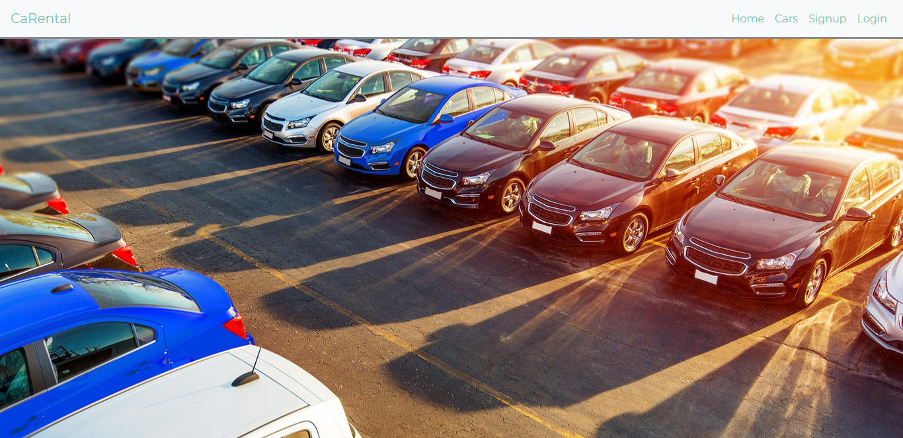
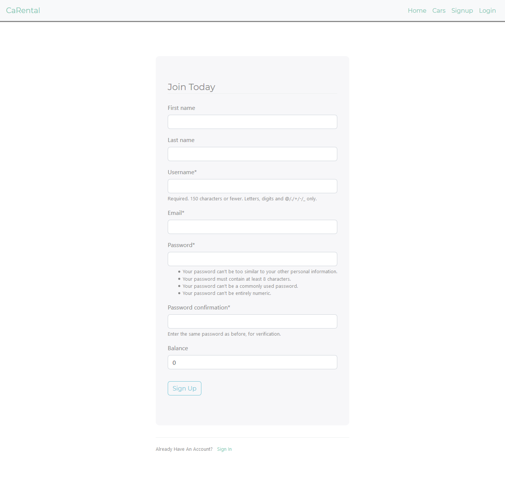
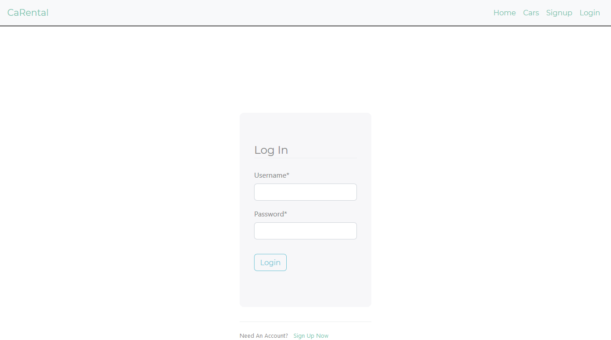
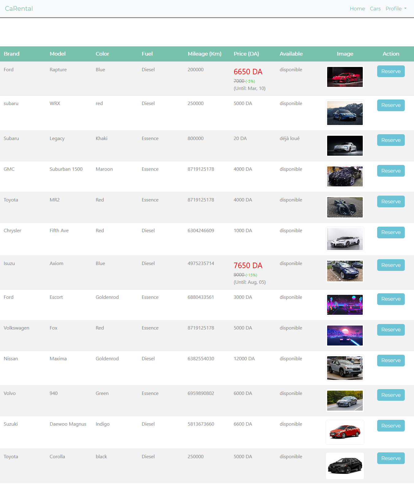
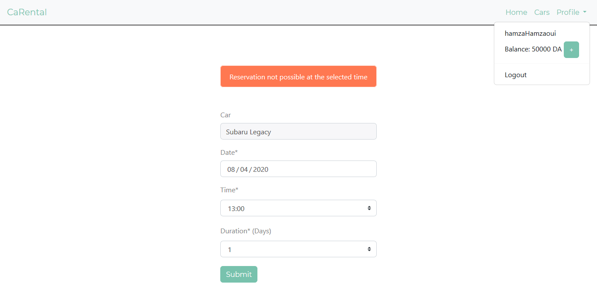
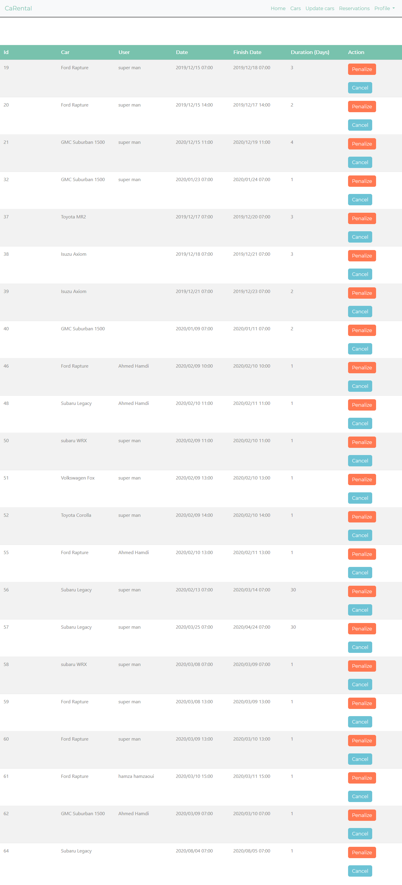
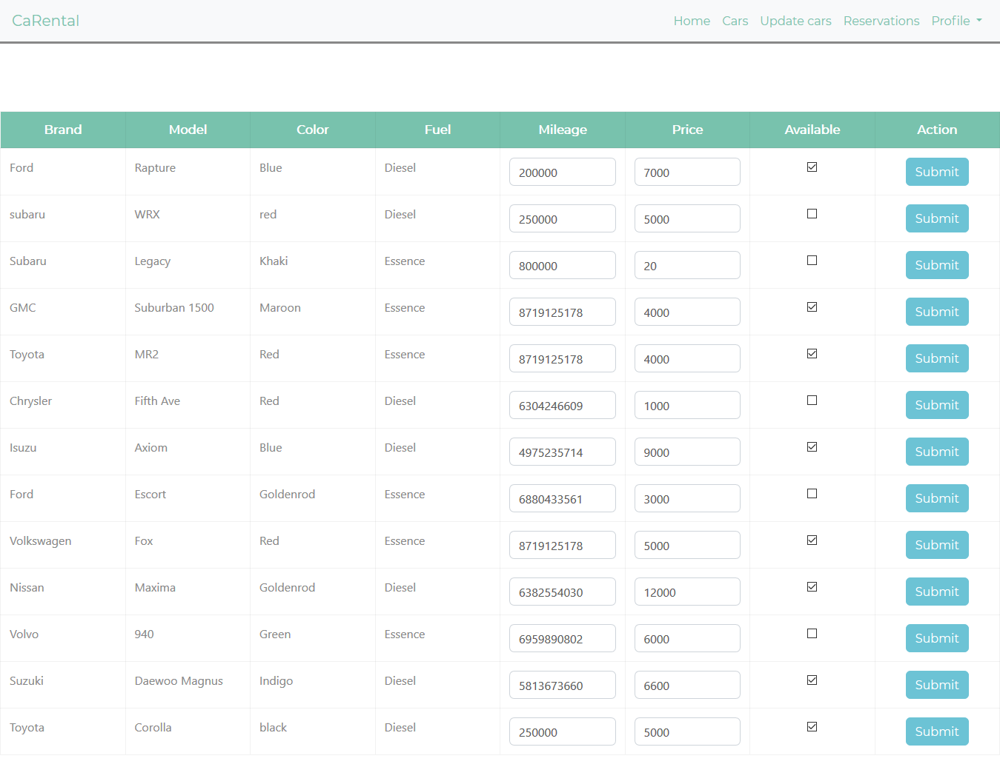

# CaRental
A website to make rental cars reservations built with Django.

***

### Usage:
- `git clone https://github.com/Badredine-Kheddaoui/carental`

- `pip install -r requirements.txt`

- `python manage.py makemigrations`

- `python manage.py migrate`

- `python manage.py runserver`

- go to 'http://127.0.0.1:8000/'

***

### Tech stack
- Django on the server side.
- jQuery and Bootstrap for responsiveness.
- AJAX/Django communication to update parts of the page without refreshing the whole page.

***

### Features
- A custom user model that extends the default Django's with more functionality.
- An admin panel to add, update and delete users, cars, car sales and reservations.
- Since most HTML pages have similar sections, They all extend a base HTML page.
- Notify users if their reservation was cancelled and of new car sales.

***

### Security Measures
- User passwords are hashed before they are saved in the database.
- Protection against Cross Site Request Forgeries by sending the user a token that has to be returned when submitting the form.
- Input fields are sanitized to prevent JavaScript injections.
- Database queries are protected from SQL injection by using query parameterization.

***

### Screenshots

#### The home page:

#### Register:

#### Login:

#### The cars page:

#### Making a reservation:

#### Reservations(only accessible to the admin):

#### Updating cars(only accessible to the admin):

<<<<<<< HEAD

=======
